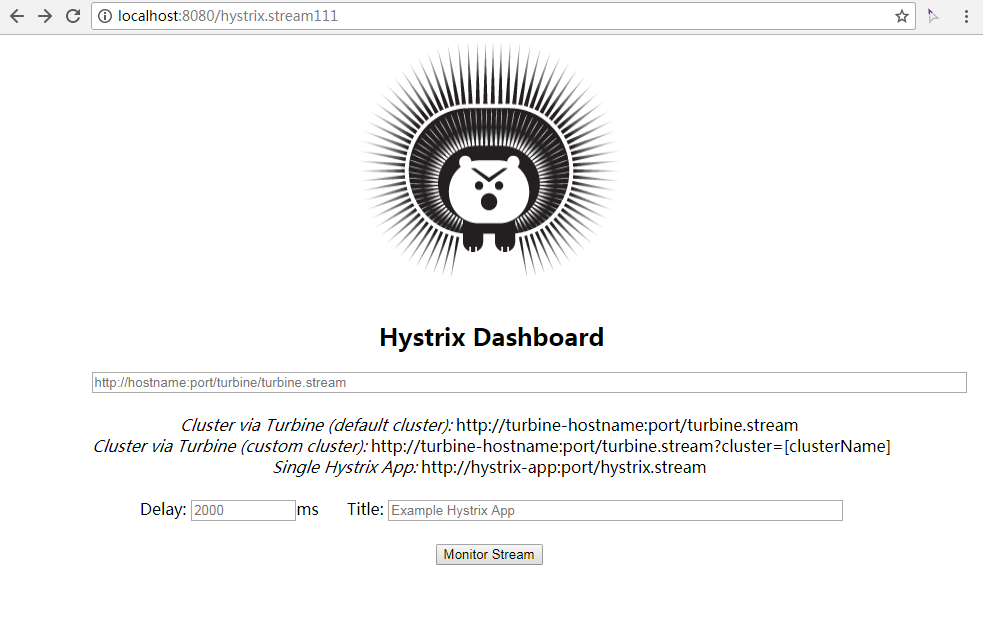
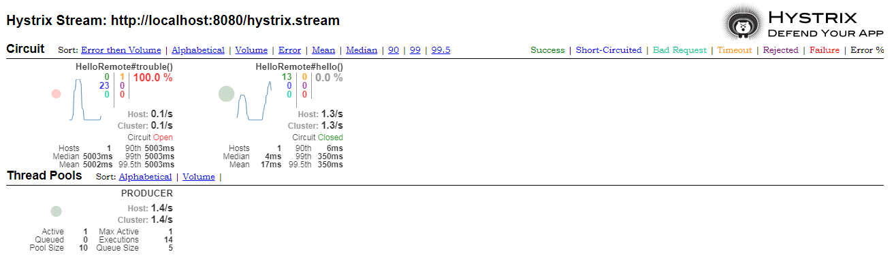

# Cloud Spring 演示

本项目演示在单机上部署Cloud Spring，演示了服务注册、负载均衡、熔断器等特性。

## 预备

修改计算机上的hosts文件，添加

```
127.0.0.1 peer1  
127.0.0.1 peer2  
```

## 注册中心

Eureka-server项目中配置Eureka集群（2节点）部署方式。

启动Eureka Server项目两次，分别带上参数：

```
--spring.profiles.active=peer1
--spring.profiles.active=peer2
```

在浏览器中分别访问http://peer1:8761和http://peer2:8762，在页面的`DS Replicas`中看到两个Server相互注册。

## 服务提供

Producer项目中配置了两个服务提供者，分别启动参数：

```
--spring.profiles.active=producer1
--spring.profiles.active=producer2
```

可以在http://peer1:8771/和http://peer1:8772/访问到这两个服务，分贝返回：

```
Hi, i'm producer1
Hi, i'm producer2
```

## 负载均衡

启动consumer项目，多次访问http://localhost:8080/hello，分别返回producer1和producer2内容。

## 熔断器

访问http://localhost:8080/trouble。第一次访问，等待5秒后返回

```
Sorry, some trouble occurred
```

紧接着再访问，很快就返回。说明熔断器开启了短路。过半分钟后，又出现5秒返回，说明短路过期关闭。

## 熔断器监控

本项目中为Consumer集成了Dashboard。浏览器访问http://localhost:8080/hystrix，出现Hystrix Dashboard。



输入框中输入http://localhost:8080/hystrix.stream。点击`Monitor Stream`。如果没有请求，会显示Loading。访问上面的[hellol](http://localhost:8080/hello)或者[trouble](http://localhost:8080/troble)请求后，dashboard中会统计请求状况。



## 集群Dashboard

上节中一个页面上只能在展示一个节点的监控信息。Netflix提供了[Turbine](https://github.com/Netflix/Turbine)来聚合多个节点监控。

允许项目`turbine`。该项目中集成了Dashboard，所以访问http://localhost:8888/hystrix来打开监控视图，输入http://localhost:8888/turbine.stream开始监控多服务。

*(TODO: Create more consumer to monitor)*

## 感谢

感谢[纯洁的微笑](http://www.ityouknow.com/spring-cloud.html)。