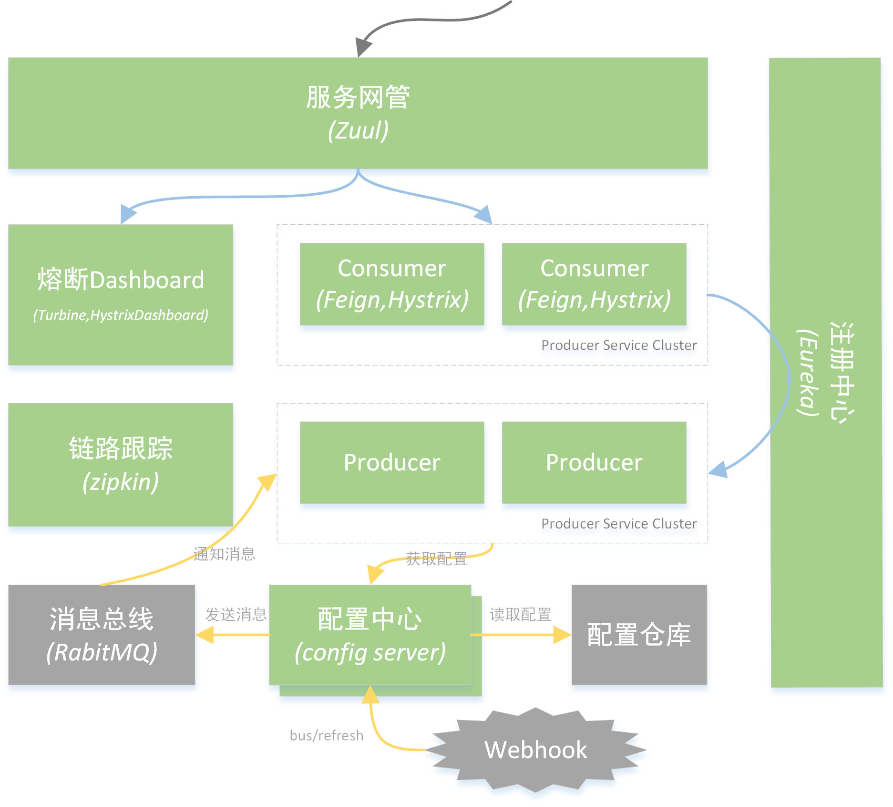
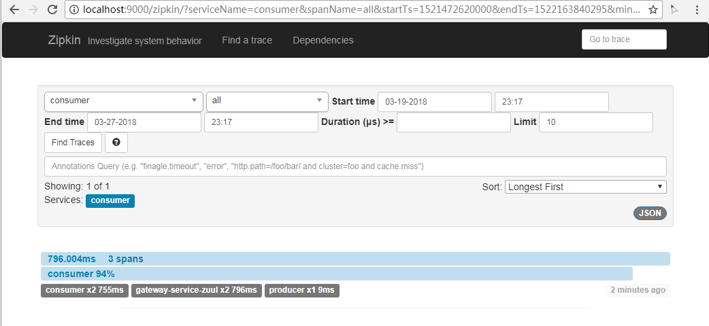

# Cloud Spring 演示

本项目演示在单机上部署Cloud Spring，演示了服务注册、负载均衡、熔断等特性。整体架构如下所示：



## 预备

修改计算机上的hosts文件，添加

```
127.0.0.1 peer1  
127.0.0.1 peer2  
```

## 注册中心

Eureka-server项目中配置Eureka集群（2节点）部署方式。

启动Eureka Server项目两次，分别带上参数：

```
--spring.profiles.active=peer1
--spring.profiles.active=peer2
```

在浏览器中分别访问http://peer1:8761和http://peer2:8762 ，在页面的`DS Replicas`中看到两个Server相互注册。

## 服务提供

Producer项目中配置了两个服务提供者，分别启动参数：

```
--spring.profiles.active=producer1
--spring.profiles.active=producer2
```

可以在http://peer1:8771/ 和http://peer1:8772/ 访问到这两个服务，分贝返回：

```
Hi, i'm producer1
Hi, i'm producer2
```

## 负载均衡

启动consumer项目，多次访问http://localhost:8080/hello ，分别返回producer1和producer2内容。

## 熔断器

访问http://localhost:8080/trouble 。第一次访问，等待5秒后返回

```
Sorry, some trouble occurred
```

紧接着再访问，很快就返回。说明熔断器开启了短路。过半分钟后，又出现5秒返回，说明短路过期关闭。

## 熔断器监控

本项目中为Consumer集成了Dashboard。浏览器访问http://localhost:8080/hystrix ，出现Hystrix Dashboard。


输入框中输入http://localhost:8080/hystrix.stream 。点击`Monitor Stream`。如果没有请求，会显示Loading。访问上面的[hellol](http://localhost:8080/hello)或者[trouble](http://localhost:8080/troble)请求后，dashboard中会统计请求状况。


## 集群Dashboard

上节中一个页面上只能在展示一个节点的监控信息。Netflix提供了[Turbine](https://github.com/Netflix/Turbine)来聚合多个节点监控。

允许项目`turbine`。该项目中集成了Dashboard，所以访问http://localhost:8888/hystrix 来打开监控视图，输入http://localhost:8888/turbine.stream 开始监控多服务。

*(TODO: Create more consumer to monitor)*

## 配置中心

### 消息队列

搭建RabbitMQ，作为配置更新通知。修改consumer的[application配置](consumer/src/main/resources/application.properties)中rabitmq的配置。

### 配置服务器

按照实际路径修改[config-server/src/main/resources/application.yml](config-server/src/main/resources/application.yml)中的search-locations。

打开config-server启动两次，分别制定不同的端口

```
--server.port=8775
--server.port=8776
```

启动config-server项目。分别访问http://localhost:8775/greeting-config/dev 和http://localhost:8775/greeting-config/pro，返回：

```json
{
  "name":"greeting-config",
  "profiles":[
    "dev"
  ],
  "label":null,
  "version":null,
  "state":null,
  "propertySources":[
    {
      "name":"file:E:/Projects/springcloud-demo/conf-local/greeting-config-dev.properties",
      "source":{
        "greeting":"welcome to development enviroment"
      }
    }
  ]
}
```

和

```json
{
  "name":"greeting-config",
  "profiles":[
    "pro"
  ],
  "label":null,
  "version":null,
  "state":null,
  "propertySources":[
    {
      "name":"file:E:/Projects/springcloud-demo/conf-local/greeting-config-pro.properties",
      "source":{
        "greeting":"welcome to product enviroment"
      }
    }
  ]
}
```

修改`greeting-config-dev.properties`中的配置内容后重现访问，得到新值。

### 从配置服务器获取配置

访问http://localhost:8080/greeting ，返回配置中心中的值。

修改配置文件中值，然后想配置中心发送刷新命令

```bash
curl -X POST http://localhost:8775/bus/refresh
```

再次查看http://localhost:8080/greeting ，得到修改后的值。

## 服务网关

运行zuul项目，访问http://localhost/consumer/greeting ，得到后端服务的返回。

### 过滤器

访问后端服务时，观察gateway的日志中打印出请求和返回，这是由`Zuul Filter`注入的。

```
-->>> GET http://localhost/consumer/greeting
<<<-- GET http://localhost/consumer/greeting, 200
```

### 路由熔断

访问http://localhost/consumer/trouble ，返回

```
The service is unavailable.
```

后端异常由Zuul拦截。

### 路由重试

访问http://localhost/consumer/trouble 时候，观察producer的日志，一个请求打了两次

```
You are in trouble
You are in trouble
```

请求被重发了两次，这与Gateway中的retry配置一致。

## 链路跟踪

启动`tracer-server`项目。尝试访问http://localhost/consumer/hello ，浏览器访问http://localhost:9000/zipkin/ 打开跟踪器视图，选择合适的时间段，点击`Find Traces`，显示出刚才的访问链路。



## 感谢

感谢[纯洁的微笑](http://www.ityouknow.com/spring-cloud.html)。